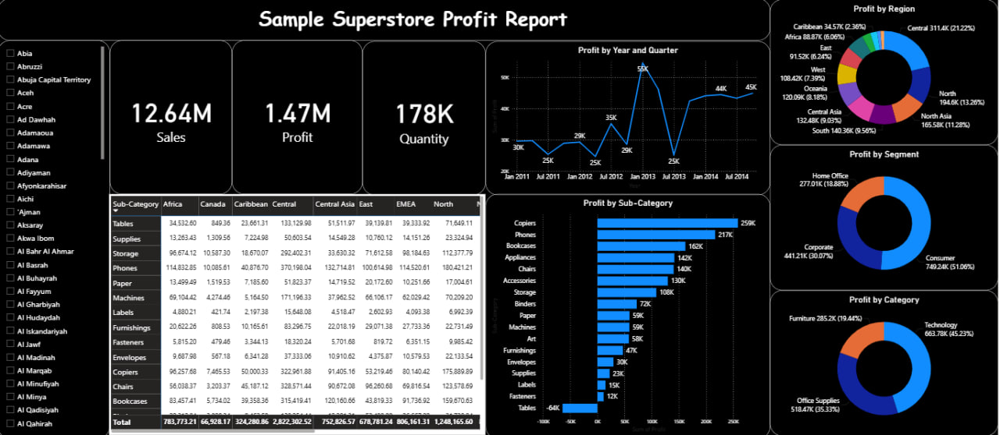

# Sample Superstore Profit Report

## Table of Contents

- [Project Overview](#project-overview)
- [Tools Used](#tools-used)
- [Dataset Description](#dataset-description)
- [Data Preparation](#data-preparation)
- [Key KPIs](#key-kpis)
- [Dashboard Features](#dashboard-features)
- [Insights](#insights)
- [Recommendations](#recommendations)
- [Dashboard Preview](#dashboard-preview)

## Project Overview

This project involves developing an interactive Power BI dashboard to analyze sales, profit, quantity, and performance across regions, customer segments, product categories, and sub-categories.

The dashboard helps users monitor business performance and identify profitable and low-performing areas for better decision-making.

**The analysis focuses on:**

- Monitoring total sales, profit, and quantity sold
- Analyzing profit performance by region
- Comparing profit across customer segments
- Evaluating profit by product category and sub-category
- Tracking profit trends by year and quarter
- Identifying high-performing and low-performing product sub-categories
- Filtering results by geographic location

## Tools Used

- Microsoft Power BI
- Microsoft Excel
- Power Query
- DAX

## Dataset Description

The dataset contains sales transaction data from a sample superstore business.

Key fields used in the analysis include:

- Sales
- Profit
- Quantity
- Product Category
- Product Sub-Category
- Customer Segment
- Region
- Country and City
- Order Date
- Year and Quarter

## Data Preparation

Main data preparation steps performed in the project:

- Cleaned and standardized location, category, and segment fields
- Checked for missing values and duplicate records
- Created relationships between tables for effective data modeling
- Created calculated measures for Total Sales, Total Profit, and Total Quantity
- Created time-based calculations for profit analysis by year and quarter
- Grouped products by category and sub-category
- Prepared geographic fields for location-based filtering
- Designed interactive slicers for country and region analysis

## Key KPIs

- **Total Sales:** 12.64M
- **Total Profit:** 1.47M
- **Total Quantity Sold:** 178K
- **Top Performing Sub-Category:** Copiers
- **Highest Profit Category:** Technology
- **Largest Customer Segment by Profit:** Consumer

## Dashboard Features

### 1. KPI Cards

The dashboard displays key business performance indicators:

- Total Sales
- Total Profit
- Total Quantity Sold

### 2. Profit by Year and Quarter

A line chart showing profit trends over time to help identify periods of strong and weak business performance.

### 3. Profit by Region

A donut chart showing the contribution of each region to total profit.

### 4. Profit by Segment

A donut chart comparing profit across customer segments:

- Consumer
- Corporate
- Home Office

### 5. Profit by Category

A donut chart showing profit contribution by product category:

- Technology
- Office Supplies
- Furniture

### 6. Profit by Sub-Category

A bar chart ranking product sub-categories based on total profit.

This visualization helps identify the most profitable product groups, such as:

- Copiers
- Phones
- Bookcases
- Appliances
- Chairs

It also highlights low-performing or loss-making sub-categories, such as Tables.

### 7. Geographic Filter

An interactive location slicer allows users to filter the dashboard by country, state, city, or region.

### 8. Regional Sales Table

A detailed matrix table displays sales performance by product sub-category across different regions.

## Insights

- The business generated **12.64M in total sales** and **1.47M in total profit**.
- Technology was the most profitable product category.
- Copiers generated the highest profit among all product sub-categories.
- Tables showed negative profit, indicating a potential pricing, discount, cost, or product strategy issue.
- The Consumer segment contributed the largest share of total profit.
- Profit performance varied across regions, showing opportunities to focus on high-performing markets and improve low-performing ones.
- Profit trends changed across quarters, with some periods showing significantly higher profitability than others.

## Recommendations

- Review the pricing, discount, and cost structure of Tables because the sub-category is generating losses.
- Prioritize sales and marketing efforts for high-profit sub-categories such as Copiers, Phones, and Bookcases.
- Focus on Technology products because they generate the highest overall profit.
- Analyze low-performing regions to identify operational, pricing, or market-related challenges.
- Develop targeted strategies for Corporate and Home Office segments to increase their profit contribution.
- Monitor quarterly profit trends to improve sales forecasting and business planning.
- Use the geographic filter to support region-specific decision-making and performance monitoring.

## Dashboard Preview

> Add your dashboard screenshot to your GitHub repository and rename it as `dashboard-preview.png`.
